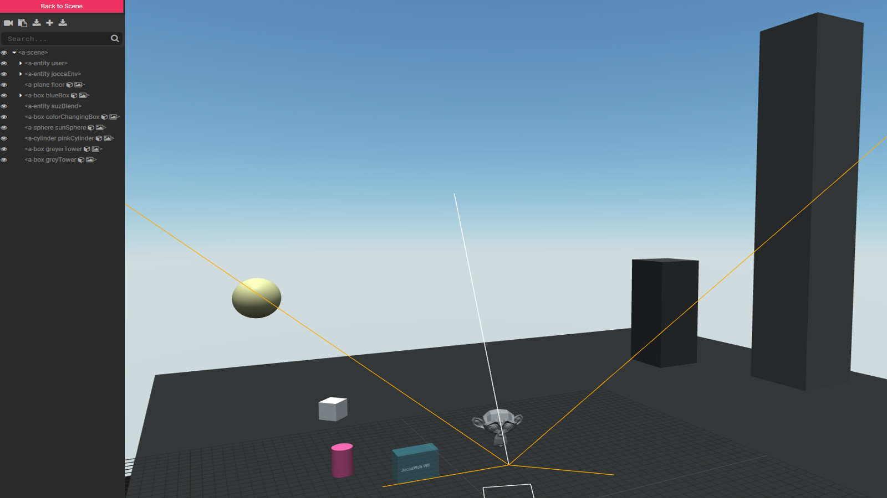

# a-frame-vr-boilerplate
Browser VR experiences in A-Frame

JoccaWeb.nl july 2018

Welcome to my VR - A-Frame - JavaScript "starter-kit" or "boilerplate"!

 

This boilerplate assumes intermediate knowledge of vanilla JavaScript, HTML5 and Webpack (and Yarn). Some A-Frame and Blender beginner knowledge wouldn't hurt either.

The goal of this project is to have a (relatively) quick way to set up VR experiences in the browser for frontend developers. 
If you're more inclined to strictly game-developing in VR, I would advise Unity. Unity does have somewhat JavaScript-like support but you'll find it's very handy to know C#. Nevertheless, in A-Frame there are a lot of possibilities for interactive VR experiences directly in the browser for users with any VR headset.

(Babel and React are configured in for ES6 and React support, but not particarly used, it was just handy to keep it in for possible React - A-Frame projects)

To make production code for A-Frame projects, I use an A-Frame minified file and host it myself, using a script tag. During development I use Webpack 4 with CDN script tags for A-Frame and it's components.

So start up the project and build your own VR experience in A-Frame!

## Development log

- With version 0.8.0, some components (K-Frame, A-Frame Extra's and others) don't work (yet). I'll keep it on 0.7.0 for now. The environment component now does work with 0.8.0. I'll disable it's floor, so that I have more control. For example, making a hole in the floor for a pond/sea/swimming pool.
- I installed Webpack 4 and A-Frame through NPM and it worked, but there was an exceeded asset size warning. I'm unsure if it's necessary to configure Webpack 4 to split chunks for this. I'll wait 'till I see some more a-frame webpack 4 examples online.
- Custom A-Frame components reside in the components directory.
- Installed the Environment Component (version nr. unknown, it's the most recent version from june 2018).
- For setting up animations you can choose a-animation and/or the animation component (K-Frame). For events choose vanilla JavaScript and/or the event set component. For each project you'll have to figure out what to use best.
- I imported a Blender 3D model with the Kronos plugin as a Gltf file. Blender's latest version is 2.79. 2.80 will include Gltf export out of the box.
- Installed Khronos Blender to Gltf exporter, see Resources.
- Installed glTF Tools extension. To preview glTF models with this extension, at least a material node has to be added. Added default Material.001 in Blender (Properties panel, Material tab). Camera and Lamp also have emtpy nodes. In Blender, removed camera and lamp. Preview works!
- Placed the model in the scene. See index.html and a-frame docs, search for glTF.

## Debugging and publishing a project on smartphone and Gear VR

Load the local server URL on your smartphone (while working in development mode). If your phone and computer are not on the same LAN, consider using [Ngrok](https://ngrok.com/) for local development and testing. [BrowserSync](https://www.browsersync.io) is also worth a gander.

The basic controls will work on Oculus Rift and HTC Vive too. 
`npm start` opens the page on for example <http://192.168.1.100:3000/>, see the start script in package.json. On your comparable url, in your own local network, with working WIFI, you should be able to use it on your smartphone browser right away with CardBoard/Gear VR. This is all in a development situation, we're not publishing our app here. The port setting is in the start script. Also possible is typing the following in the cli: `PORT=8000 npm start` (providing the start script has the port setting removed).

You can also publish your development build for free with Surge. Visit the Surge site and read the info, then make two surge websites online (this is quite easy and you can do it fast). One with a clickable link to <ovrweb:http://surge-url-of-your-a-frame-app/>, and one wich is your a-frame app itself. The `ovrweb:` prefix 'll make your smartphone ask to put the phone in the Gear VR and you can go inside your VR creation!
This is assuming you're using the Oculus app on your smartphone, it'll also work for the Rift and the Vive, only then your PC will probably mention to put on the headset connected to your desktop/laptop.
For CardBoard no ovrweb prefix is used, just tap on the CardBoard symbol.

For the Gear VR: Required is that you have a recent smartphone with an installed Oculus app and within that app an installed Carmel Browser. When you're trying out your Gear VR you'll do this almost automatically.

Update june 2018: Now you can put on the headset, start the Oculus browser and surf to the url of your project. Activate the cardboard icon with the headset-controls and you're in!

## Resources

- [A-Frame site](https://aframe.io/)
- [A-Frame on GitHub (including boilerplate code)](https://github.com/aframevr)
- [A-Frame's changelog](https://github.com/aframevr/aframe/blob/master/CHANGELOG.md)
- [A-Frame Registry](https://aframe.io/aframe-registry/)
- [A-Frame K-Frame (Kevin Ngo, Animion- and Event Set Component ao.)](https://github.com/ngokevin/kframe)
- [A-Frame Extra's](https://github.com/donmccurdy/aframe-extras)
- [A-Frame Environment Component](https://github.com/feiss/aframe-environment-component)
- [A-Frame Gradient Sky](https://github.com/zcanter/aframe-gradient-sky)

- [Surge](https://surge.sh)
- [Ngrok](https://ngrok.com/)
- [BrowserSync](https://www.browsersync.io)

- [Blender](https://www.blender.org/)
- [Unity](https://unity3d.com/)
- [The Blender Khronos Plugin](https://www.khronos.org/assets/uploads/developers/library/2017-webinar-mastering-the-khronos-blender-gltf-20-exporter/Khronos_UX3D_Blender_Webinar_Oct17.pdf)
- [The GlTF 3D model standard](https://en.wikipedia.org/wiki/GlTF)
- [The Khronos Blender Exporter](https://github.com/KhronosGroup/glTF-Blender-Exporter)

